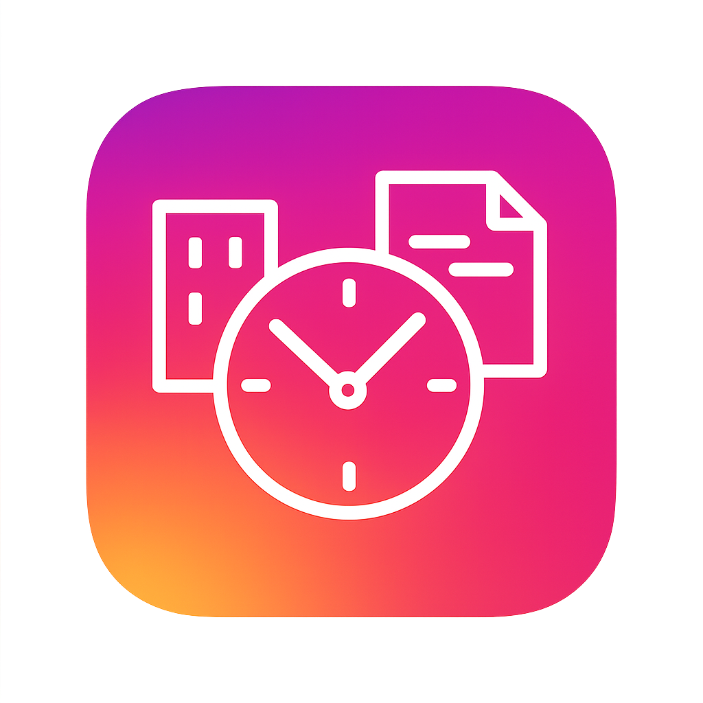

# TimeClock App

<div align="center">
  
  
  **勤怠管理を自動化するデスクトップアプリケーション**
  
  [](https://github.com/your-username/dakoku-app/releases)
  [](LICENSE)
  [](https://github.com/your-username/dakoku-app/releases)
  [](https://github.com/your-username/dakoku-app/releases)
</div>

## 🚀 概要

TimeClock Appは、JobcanとSlack Workflow Plusでの勤怠打刻を自動化するElectronアプリケーションです。
毎日の出勤・退勤処理を効率化し、打刻忘れを防止します。

### ✨ 主な機能

- **🏢 Jobcan自動打刻**: 出勤・退勤時刻の自動入力と送信
- **💬 Slack Workflow Plus対応**: 勤怠ワークフローの自動送信

## 💻 動作環境

- **macOS**: 10.14 (Mojave) 以降
- **Windows**: Windows 10 以降
- **メモリ**: 4GB RAM以上推奨
- **ストレージ**: 約500MB

## 📦 インストール

### macOS
1. [Releases](https://github.com/your-username/dakoku-app/releases)から最新版をダウンロード
2. `TimeClock App-x.x.x.dmg`をダブルクリック
3. アプリケーションフォルダにドラッグ&ドロップ


MacOSの場合、ライセンス認証を通してストアに登録しているアプリではないのでApplicationに移動させても"壊れています"という旨のメッセージが出てしまい、そのままだと開けません。
Applicationに移動させた後、

```sh
 sudo xattr -rd com.apple.quarantine "/Applications/TimeClock.app"
```
としてチェックを外してから開く必要があります。

### Windows
1. [Releases](https://github.com/your-username/dakoku-app/releases)から最新版をダウンロード
2. `TimeClock App Setup x.x.x.exe`を実行
3. インストールウィザードに従ってセットアップ

## ⚙️ 初期設定

### 1. 勤務時間の設定
- アプリを起動後、「設定」タブを開く
- 出勤時刻・退勤時刻を設定（例：9:00、18:00）

### 2. Jobcan設定
- JobcanのログインURL
- メールアドレスとパスワード
- 「テスト」ボタンで動作確認

### 3. Slack Workflow Plus設定
- ワークスペース名
- Googleアカウント情報
- 対象チャンネルURL（オプション）

## 🎯 使用方法

### 基本操作
1. **出勤時**: 「Jobcan 出退勤」または「出勤」ボタンをクリック
2. **退勤時**: 「退勤」ボタンをクリック
3. **両方実行**: メインボタンで出勤・退勤を一度に処理

### テストモード
- 設定画面の「テスト」ボタンで実際の送信なしで動作確認
- フォーム入力まで実行され、送信はスキップされます

## 🔧 技術仕様

### 使用技術
- **フレームワーク**: Electron 30.x
- **フロントエンド**: React 18 + TypeScript
- **UI**: Blueprint.js
- **状態管理**: TanStack Query
- **自動化**: Playwright (Chromium)
- **設定管理**: electron-store

### アーキテクチャ
```
┌─────────────────┐    ┌──────────────────┐
│   React UI      │    │  Electron Main   │
│   (Renderer)    │◄──►│   Process        │
└─────────────────┘    └──────────────────┘
                                │
                       ┌─────────▼─────────┐
                       │   Playwright      │
                       │   Services        │
                       └─────────┬─────────┘
                                 │
                    ┌────────────┴────────────┐
                    ▼                         ▼
            ┌───────────────┐         ┌──────────────┐
            │    Jobcan     │         │   SlackWF    │
            │  Web Service  │         │   Service    │
            │               │         │      │       │
            │ ┌───────────┐ │         │ ┌────▼────┐  │
            │ │ Form Auto │ │         │ │ Google  │  │
            │ │   Fill    │ │         │ │  Auth   │  │
            │ └───────────┘ │         │ └─────────┘  │
            └───────────────┘         │ ┌─────────┐  │
                                      │ │Workflow │  │
                                      │ │ Submit  │  │
                                      │ └─────────┘  │
                                      └──────────────┘
```

## 🚧 開発

### 前提条件
- Node.js 20.x 以降
- npm または yarn

### セットアップ
```bash
# リポジトリのクローン
git clone https://github.com/your-username/dakoku-app.git
cd dakoku-app

# 依存関係のインストール
npm install

# Playwrightのセットアップ
npx playwright install chromium

# 開発サーバーの起動
npm run dev
```

### ビルド
```bash
# macOS用
npm run build:mac

# Windows用
npm run build:win

# 開発用（distディレクトリのみ）
npm run build:dir
```

### コード品質
```bash
# リンターの実行
npm run lint

# フォーマットの適用
npm run format
```

## ⚠️ 免責事項

- このアプリケーションは非公式ツールです
- 使用は自己責任でお願いします
- Jobcan・Slack Workflow Plusの仕様変更により動作しなくなる可能性があります
